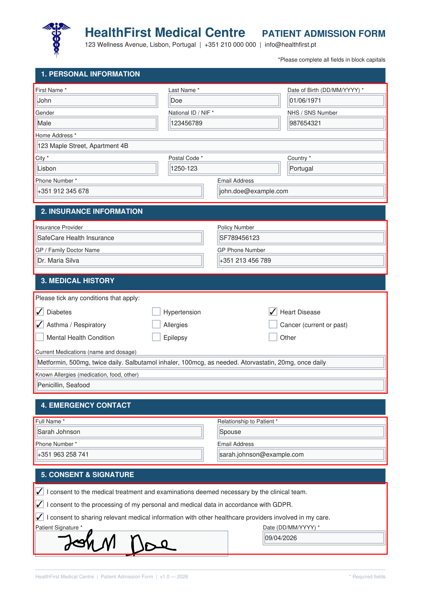
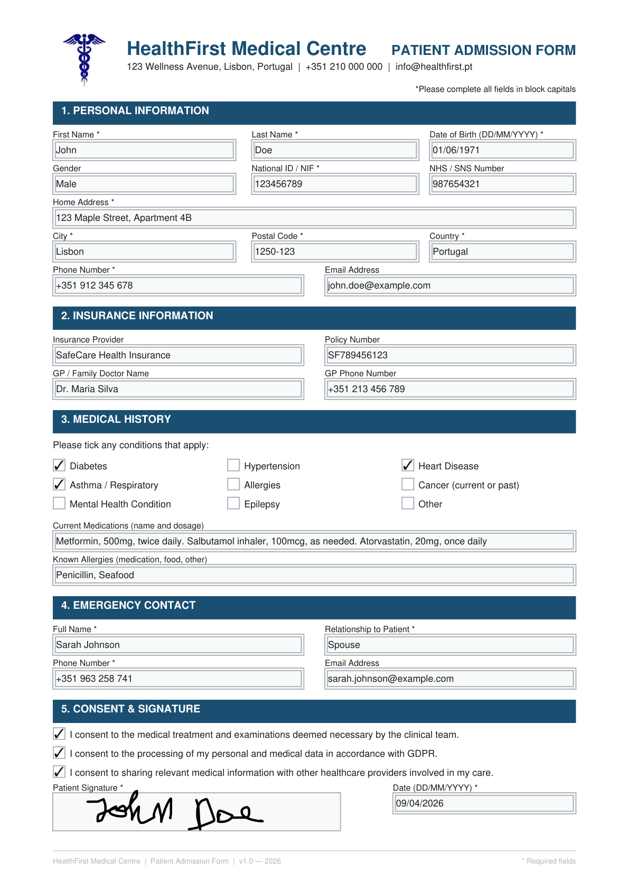
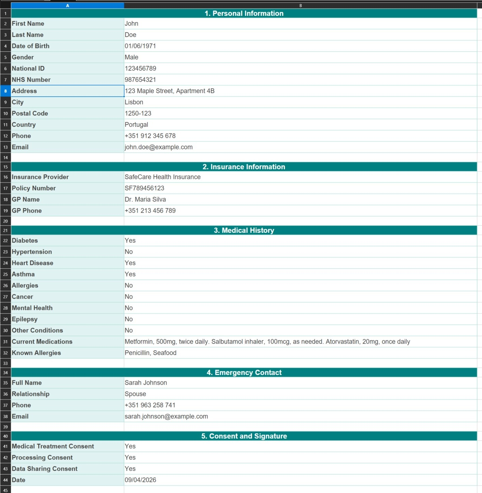

# Python Fillable PDF Form Extractor

Extract structured data from filled AcroForm PDFs using area-based field detection — no internal knowledge of the form required.

*Status: April 2026*

This project is the second half of a two-part cycle:

> [**Part 1 — Generate**](https://github.com/hasff/python-fillable-pdf-form-generator): Build a fillable AcroForm PDF from scratch with Python and ReportLab.

> **Part 2 — Extract** *(this repo)*: Read a filled AcroForm PDF and extract its data programmatically — without knowing anything about how the form was built.

---

#### ⚡ Quick Navigation: [The Problem](#the-problem) | [How it Works](#how-it-works) | [The Debug Step](#the-debug-step) | [Output](#output) | [Quick Start](#quick-start) | [📩 Get in Touch](#need-this-for-your-organisation)

---

## The problem

A filled PDF lands in your inbox. A patient admission form. A client onboarding document. A signed consent form. The data is all there — name, date of birth, conditions, contact details — locked inside a file that someone has to open, read, and manually copy into a spreadsheet or system.

Multiply that by dozens of forms a day. Hundreds a month.

The obvious question is: *can't we just read the data out of the PDF automatically?*

Yes — if the form was built as a proper AcroForm. And that is exactly what this project does.

---

## A note on approach

Because I also built the form in Part 1, I already know every field name. I could have used those names directly to extract the data. It would have been three lines of code.

But that is not the interesting problem to solve.

In any real workflow, the form arrives from a third party — a clinic, a partner, a government body. You do not have the source file. You do not know the field names the developer chose. You only know what you can see: the layout of the form, and roughly where each section lives on the page.

This project was deliberately built to simulate that situation. The extraction is done entirely by **spatial position** — not by field name. If you can see where a section is on the page, you can extract it.

---

## How it works

AcroForm fields are interactive objects embedded in the PDF structure. Each field has a position — a bounding rectangle that defines exactly where it sits on the page. PyMuPDF exposes those positions directly.

The approach has two stages:

```
program.py
    │
    ├── INSPECTION
    │     ├── get_doc_dimensions()       — read page size in points
    │     ├── inspect_form_sections()    — define section areas as % of page height
    │     └── draw_section_areas()       — render coloured boxes onto a debug PDF
    │
    └── EXTRACTION
          ├── get_all_widgets()          — collect every AcroForm field on the page
          ├── get_widgets_in_area()      — filter fields that fall inside a given rect
          ├── get_field_value_by_label() — find a field by partial label match
          └── generate_excel()           — write extracted data to a formatted .xlsx
```

### Stage 1 — Inspection

Before extracting anything, you need to know where each section lives on the page. Rather than guessing coordinates, the project includes an inspection mode that draws coloured rectangles over the form and saves it as a separate PDF.

Section boundaries are defined as percentages of the page dimensions — which means they adapt to any page size:

```python
sections = [
    (x1, height * 0.14, x2, height * 0.34),  # 1. Personal Information
    (x1, height * 0.37, x2, height * 0.46),  # 2. Insurance Information
    (x1, height * 0.49, x2, height * 0.66),  # 3. Medical History
    ...
]
```

Once the boxes look right visually, the inspection step also prints the exact pixel coordinates — ready to paste into the extraction config.

### Stage 2 — Extraction

With coordinates confirmed, each AcroForm field is matched to a section based on whether its bounding rectangle intersects the section area. Fields that fall inside a section are grouped together. Values are then retrieved by partial label match — so `"Date"` finds the field labelled `"Date of Birth (DD/MM/YYYY) *"` without needing to know the full string.

```python
personal_info_widgets = get_widgets_in_area(all_widgets, fitz.Rect(sections[0]))
date_of_birth = get_field_value_by_label(personal_info_widgets, "Date")
```

---

## The debug step

Running `inspect_form_sections()` produces a debug PDF showing exactly which areas will be used for extraction. This is the calibration step — adjust the percentages until each box covers the right section.



---

## Output

Once extraction runs, the data is written to a formatted Excel file — one row per field, grouped by section, with colour-coded headers.

### Input — the filled form



### Output — the extracted Excel



All 35 fields extracted. No manual copying. No OCR. No AI quota.

---

## Why not use AI for this?

You could. Send the PDF to a vision model, ask it to extract the fields, parse the JSON response. It works reasonably well for simple forms.

The trade-offs:

- **Cost per call.** Every extraction consumes tokens. At volume, that adds up.
- **Rate limits.** High-throughput processing hits API limits quickly.
- **Non-determinism.** The same form can return slightly different field names or structures across calls.
- **Dependency.** Your pipeline breaks if the API is down or the model changes.

AcroForm extraction is deterministic, free to run, and works offline. If the form was built as a proper AcroForm — which any programmatically generated form will be — structured extraction is the right tool.

*(Using AI to extract data from scanned or non-interactive PDFs is a different problem entirely — and a natural next step from here.)*

---

## What the form contains

| Section | Fields |
|---|---|
| Personal Information | First name, last name, date of birth, gender, national ID, NHS number, address, city, postal code, country, phone, email |
| Insurance Information | Provider, policy number, GP name, GP phone |
| Medical History | 9 condition checkboxes, current medications, known allergies |
| Emergency Contact | Full name, relationship, phone, email |
| Consent & Signature | 3 consent checkboxes, date |

---

## Quick Start

```bash
git clone https://github.com/hasff/python-fillable-pdf-form-extractor.git
cd python-fillable-pdf-form-extractor
python -m venv venv
source venv/bin/activate   # Windows: venv\Scripts\activate
pip install -r requirements.txt
python program.py
```

The extracted data will be written to:

```
output/extracted_data.xlsx
```

To run the debug/inspection step instead, set `inspect=True` in the `extract_data_from_form()` call inside `__main__`. The debug PDF will be saved to:

```
output/boxes.pdf
```

---

## Need this for your organisation?

Paper forms and manual data entry are expensive problems — and they compound. Every form that gets filled, scanned, and typed into a system by hand is time and money that could be automated.

I build PDF data extraction pipelines for:

- healthcare providers processing patient intake, consent, and referral forms
- legal and compliance teams handling standardised document workflows
- HR departments digitising onboarding and employee record collection
- any organisation that currently copies data out of PDFs by hand

The solution adapts to your existing forms — no redesign required, as long as they are AcroForm-based.

📩 Contact: hugoferro.business(at)gmail.com

🌐 Courses and professional tools: https://hasff.github.io/site/

---

## Further Learning

The PyMuPDF techniques used in this project — AcroForm field access, coordinate-based spatial filtering, widget inspection — are covered in depth in my course:

[**Python PDF Manipulation: From Beginner to Winner (PyMuPDF)**](https://www.udemy.com/course/python-pdf-handling-from-beginner-to-winner/?referralCode=E7B71DCA8314B0BAC4BD)

The repository is fully usable on its own. The course provides the deeper understanding behind the decisions made here — including how PDF coordinates work, how AcroForm fields are structured internally, and how to build robust document processing pipelines.
